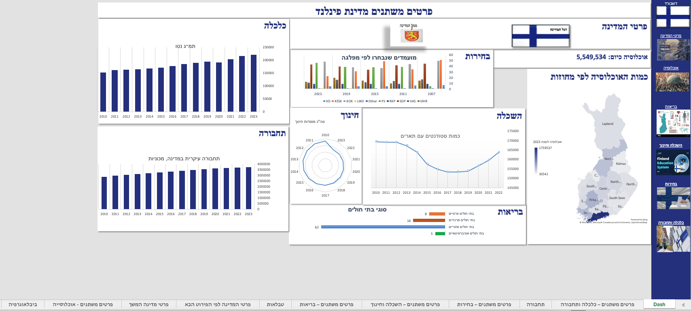

<h1 align="center">🇫🇮 Finland – Data Analysis & Policy Report</h1>

  📊 Academic project combining <b>data analytics</b> and <b>policy research</b>  
  Built with <b>Excel</b>, <b>Power Query</b>, <b>VLOOKUP</b>, and <b>pivot tables</b>

  🎓 <b>Tel-Hai College</b> • <i>Introduction to Data Analytics</i> • July 2024

---

## 📌 Overview

This project explores core aspects of Finland’s society and governance, combining desk research with hands-on Excel-based data analysis.

### Key Topics:
- 🏛️ Political system, historical background, and demographics  
- 🩺 Public health indicators and COVID-19 impact  
- 🎓 Education structure and performance  
- 💶 Economy, GDP, taxation, innovation  
- 🚲 Sustainability and urban mobility  

---

## 📁 Included Files

| File | Description |
|------|-------------|
| `Finland_Presentation.pdf` | Visual summary with data highlights |
| `project_Report.docx` | Full written report with sources and structure |
| `Finland-3.xlsx` | Excel file with data tables, VLOOKUPs, and pivot charts |

> 💡 Optionally, include screenshots or export visuals to a `/visuals/` folder.

---

## 🖼️ Dashboard Preview

## 🛠️ Tools & Methods

- **Excel**: pivot tables, VLOOKUP, Power Query  
- **PowerPoint**: storytelling and visual summaries  
- **Research**: government & EU official data portals

---

## 👥 Contributors

- **Daniel Bonder**  
- **Yossi Chen-Baadash**

---

## 🎓 Academic Context

Course: *Introduction to Data Analytics*  
Instructor: **Amos Shealtiel**  
Faculty of Business Administration, **Tel-Hai College**

---

## 💬 Summary

This project showcases our skills in:
- 🔍 Analytical thinking and policy interpretation  
- 📈 Data literacy and Excel expertise  
- 🗣️ Communicating insights through visuals and reports

---

## 📫 Contact

📧 [danielbonder123@gmail.com](mailto:danielbonder123@gmail.com)  
🔗 [LinkedIn](https://www.linkedin.com/in/daniel-bonder1/)

